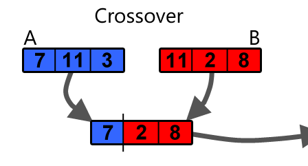

Yeah, cuối cùng đã tới bài cuối này rồi :'( Các bạn có thể đọc các bài còn lại trong series ở đây:

+ [Part 1](../tao-bot-choi-dinosaur-chrome-1/)

+ [Part 2](../tao-bot-choi-dinosaur-chrome-2/)

+ [Part 3](../tao-bot-choi-dinosaur-chrome-3/)

+ [Part 4](../tao-bot-choi-dinosaur-chrome-4/)

# Áp dụng GA trong Neural network và bài toán này

Như đã nói ở [phần 2](../tao-bot-choi-dinosaur-chrome-2/), GA không có quy định chặt chẽ về cách áp dụng. Đối với việc áp dụng GA vào bài toán này, ta cần phải quy định những điều sau:

+ Lựa chọn `encoding, mutation`(đột biến): mình chọn cách chuyển các layer (`weights, bias` của các matrix giữa các lớp) thành 1 `sequence` và coi `sequence` này là `chromosome` (bạn có thể hiểu là DNA). Về phần `mutation`, với mỗi số trong `sequence`, mình sẽ có 1 xác suất nhỏ số đấy sẽ được cộng với 1 số random nào đó (khá nhỏ so với số này).

+ Lựa chọn hàm `fitness`: thay vì lấy điểm số màn chơi làm hàm `fitness`, mình đánh giá bot nào tốt hơn bằng cách xem bot nào xử lý các cây xương rồng tốt hơn, nghĩa là lấy số cây xương rồng mà bot vượt qua được làm hàm `fitness`.

+ Lựa chọn `population, survival`: mình chọn `population` là 12. Thực ra mình thấy 12 hơi nhỏ và có lẽ 50 là con số tốt hơn, nhưng bởi vì training trên môi trường bình thường nên khá chậm. Ví dụ như 1 cá thể tốt có thể đạt tới 500 điểm, như vậy sẽ mất vài phút để chạy xong, và như vậy 1 `generation` sẽ mất vài tiếng để pass tới `generation` mới. Về `survival`, mình chọn 4 cá thể có hàm `fitness` cao nhất để nhân giống cho thế hệ sau. Sau khi thực hiện xong project, mình nghĩ nên chọn nhiều cá thể hơn làm cha mẹ, như vậy sẽ tăng thời gian training nhưng có thể đạt được hội tụ tốt hơn. Tuy nhiên kết quả project dù sao cũng tốt với thiệt lập như này.

+ Lựa chọn cách crossover: mình chọn cách cắt đôi `sequence` để thực hiện `crossover`. Do ghép từ 2 cặp cắt đôi (là có cắt `weights` và `bias`) nên sẽ có 4 kết quả. Mình chọn random trong 4 kết quả này. Bạn có thể hình dung thông qua minh hoạ dưới đây. Do chỉ có 4 cha mẹ cho 1 `generation` mới, mình lựa chọn 1 cá thể có thể nhân giống với chính nó.

<p align="center">
  <br>
  <i>Minh hoạ về cách crossover 1 sequence [Nguồn: https://becominghuman.ai/)
</i>
</p>

Mình chọn tham số nhỏ, mức đột biến rất cao, yêu cầu cha mẹ rất tốt. Đây thực ra là các setup khá tệ, may mắn là mình vẫn có kết quả tốt. Lý do chính là do mình chạy tiến độ 1 buổi seminar :3 Tuy nhiên thì chạy được là tốt rồi, những kinh nghiệm này mình sẽ dành tới lần tiếp theo.

# Code phần GA

Trước hết chúng ta cần import các package cần thiết. Chúng ta sẽ dùng  2 file `trex_nn` và `capturing_objects` để chạy môi trường, cùng vài package quen thuộc khác.

```python
import numpy as np
import trex_nn
import capturing_objects
import time
import logging
```

Tiếp đó, chúng ta khai báo các hằng số được sử dụng 

```python
N_X = 3 # size cua NN
N_H = 3 # size cua NN
N_Y = 1 # size cua NN

POP_SIZE = 12
MUTATION_PROB = 0.1
N_SIZE = 4
RANDOM_SET = [6, 5, 4, 3]
BODY_KEYS = ["W1", "W2", "b1", "b2"] # thu tu cac layer trong sequence
MUTATION_RANGE = [0.005, 0.5, 0.2, 0.05] # he so nhan cua mutation
```

Đầu tiên, ta cần 1 hàm chuyển các `parameters_set` (tức là các hệ số trong NN) sang `sequence (chromosome/DNA)` và 1 hàm theo chiều ngược lại.

```python
def cv_to_sequence(body):
    """
    cv body aka parameters_set to ADN aka sequence
    """
    sequence = []
    for key in BODY_KEYS:
        sequence.append(body[key])
    sequence_str = str(sequence)
    sequence_str = sequence_str.replace("[", "").replace("array", "")
    sequence_str = sequence_str.replace("]", "").replace("\n", "")
    sequence_str = sequence_str.replace("(", "").replace(")", "")
    sequence_str = sequence_str.replace(" ", "")
    sequence_adj = map(float, sequence_str.split(","))
    return sequence_adj

def cv_to_body(adn):
    """
    cv ADN aka sequence to body aka parameters_set
    tam thoi hard code 1 ty chu ko chac chet luon =))
    """
    params = {}
    params["W1"] = np.reshape(adn[:9], (3, 3))
    params["W2"] = np.reshape(adn[9:12], (1, 3))
    params["b1"] = np.reshape(adn[12:15], (3, 1))
    params["b2"] = np.reshape(adn[15], (1, 1))
    return params
```

Ta cũng quy định hàm `do_mutation` để thực hiện tạo đột biến cho các cá thể. Cách tạo đột biến mình có mô tả phía trên.

```python
def do_mutation(child, mutation_prob = MUTATION_PROB):
    mutation_rate = np.random.random(16)
    new_child = child[:]
    for ind in xrange(16):
        if mutation_rate[ind] < mutation_prob:
            if ind < 9:
                new_child[ind] += np.random.randn() * MUTATION_RANGE[0]
            elif ind < 12:
                new_child[ind] += np.random.randn() * MUTATION_RANGE[1]
            elif ind < 15:
                new_child[ind] += np.random.randn() * MUTATION_RANGE[2]
            else:
                new_child[ind] += np.random.randn() * MUTATION_RANGE[3]
    return new_child
```

Ta cần 1 hàm tạo ra `generation` đầu tiên, đây là các cá thể được tạo random. Trong suy nghĩ của mình, có thể có những lần fail hoàn toàn do `generation` đầu quá tệ, yeah mình chạy thử thì cũng có 1 2 lần như vậy.

```python
def genesis(pop_size = POP_SIZE):
    trex_clan = [trex_nn.initialize_parameters(N_X, N_H, N_Y) for i in xrange(POP_SIZE)]
    trex_clan = np.array(trex_clan)
    return trex_clan
```

Ta tạo ra hàm `crossver` để tạo ra 1 cá thể con từ 1 cặp cha mẹ cho trước.

```python
def crossver(adam, eva):
    weight_adam = adam[:12]
    weight_eva = eva[:12]
    bias_adam = adam[12:]
    bias_eva = eva[12:]

    cut_1 = np.random.randint(0, 12)
    cut_2 = np.random.randint(12, 16) - 12

    childs = []
    childs.append(weight_adam[:cut_1] + weight_eva[cut_1:] + bias_adam[:cut_2] + bias_eva[cut_2:])
    childs.append(weight_adam[:cut_1] + weight_eva[cut_1:] + bias_eva[:cut_2] + bias_adam[cut_2:])
    childs.append(weight_eva[:cut_1] + weight_adam[cut_1:] + bias_adam[:cut_2] + bias_eva[cut_2:])
    childs.append(weight_eva[:cut_1] + weight_adam[cut_1:] + bias_eva[:cut_2] + bias_adam[cut_2:])
    selected_child = np.random.randint(0, 4)
    return childs[selected_child]
```

Ta sẽ tiến hành `select_survivals` từ điểm fitness của các cá thể, sau đó `random_match` các cha mẹ lại, tiếp đó ta sẽ liên tục `breed_a_child` cho tới khi đạt tới size yêu cầu của generation (theo hàm `gen_to_max_size`)

``` python
def select_survivals(tribal, score):
    fitness_scores = np.array(score)
    survival_inds = (-fitness_scores).argsort()[:4]
    return tribal[survival_inds], survival_inds

def random_match(random_set = RANDOM_SET):
    number = -1
    curr_number = sum(RANDOM_SET)
    lucky_number = np.random.randint(0, curr_number)
    while lucky_number < curr_number:
        number += 1
        curr_number -= RANDOM_SET[number]
    return number

def breed_a_child(survivals):
    """
    chon 2 cha me tu survivals va crossver
    sau do cho child mutation
    """
    adam_ind = random_match(RANDOM_SET)
    eva_ind = random_match(RANDOM_SET)
    # boi vi so ok kha it --> co the cu de tu breed cung dc di
    expected_cain = crossver(survivals[adam_ind], survivals[eva_ind])
    real_cain = do_mutation(expected_cain)
    return real_cain

def gen_to_max_size(survivals, pop_size = POP_SIZE):
    curr_len = N_SIZE
    dna_survivals = map(cv_to_sequence, survivals)
    dna_tribal = dna_survivals[:]
    while curr_len < pop_size:
        new_born = breed_a_child(dna_survivals)
        dna_tribal.append(new_born)
        curr_len += 1
    new_gen = map(cv_to_body, dna_tribal)
    new_gen = np.array(new_gen)
    return new_gen
```

Để quan sát được diễn biến, cũng như lưu lại kết quả, mình cần setup file log. Mình lưu lại 2 file log để tiện theo dõi, 1 log là `brief`, nhằm lưu qua các thông tin cơ bản (như điểm `fitness` của 1 generation thôi), 1 log là `survival`, lưu lại toàn bộ các `parameters_set`. Các bạn có thể xem vài file log mình chạy trên [github của mình](https://github.com/Tulip4attoo/chrome_trex/tree/master/logs)

```python
def setup_logger(logger_name, log_file, level=logging.INFO):
    l = logging.getLogger(logger_name)
    formatter = logging.Formatter('%(asctime)s : %(message)s')
    fileHandler = logging.FileHandler(log_file, mode='w')
    fileHandler.setFormatter(formatter)
    streamHandler = logging.StreamHandler()
    streamHandler.setFormatter(formatter)

    l.setLevel(level)
    l.addHandler(fileHandler)
    l.addHandler(streamHandler)    

log_file_name_1 = time.strftime("./logs/%Y-%m-%d_%H:%M:%S_brief.log")
log_file_name_2 = time.strftime("./logs/%Y-%m-%d_%H:%M:%S_survival.log")

setup_logger('log1', log_file_name_1)
setup_logger('log2', log_file_name_2)

log1 = logging.getLogger('log1')
log2 = logging.getLogger('log2')

logging.basicConfig(filename=log_file_name_1, level=logging.INFO, 
                    format="%(asctime)s %(levelname)s %(message)s")
logging.basicConfig(filename=log_file_name_2, level=logging.INFO, 
                    format="%(asctime)s %(levelname)s %(message)s")
log1.info("Start")
log2.info("Start")
```

Cuối cùng là hàm `evolve` để tập hợp các hàm phía trên, tiến hành train liên tục và chuyển sang các generation khác. Các thông tin khi chạy đều được lưu vào log.

```python
def evolve():
    adam_eva = genesis(POP_SIZE)
    curr_gen = adam_eva.copy()
    count_gen = 0
    while True:
        log1.info("-------------------------------------------------------")
        log2.info("-------------------------------------------------------")
        print("-------------------------------------------------------")
        log1.info("Generation: {}".format(count_gen))
        log1.info("a new day has come")
        score = []
        for trex in curr_gen:
            count_cactus = capturing_objects.play_game(trex)
            score.append(count_cactus)
        log1.info(score)
        survivals, survival_inds = select_survivals(curr_gen, score)
        log1.info(survival_inds)
        log1.info("genarating next gen")
        curr_gen = gen_to_max_size(survivals, POP_SIZE)
        count_gen += 1
        log2.info(survivals)
        if max(score) > 15:
            log1.info(survivals)
            continue
        elif count_gen % 10 == 0:
            log1.info(survivals)
        log1.info("")
```

Để tiến hành train, các bạn chỉ cần chạy file [`trex_lod.py`](https://github.com/Tulip4attoo/chrome_trex/blob/master/trex_lord.py) là được.

# Kết quả

Đây là 1 ví dụ trong generation đầu tiên, bot chỉ biết cắm mặt chạy thẳng 

<p align="center">
  <br>
  <i>Gen 1
</i>
</p>

Tới generation 6 thì mọi chuyện khá hơn 1 chút, bot đã biết nhảy

<p align="center">
  <br>
  <i>Gen 6
</i>
</p>

Đây là hình ảnh con bot mà mình train tới generation 53 (sau 1 tối cắm máy cho chạy). Hồi đó mình chạy máy khác và góc quay hơi tệ :3

<p align="center">
  <br>
  <i>Gen 53
</i>
</p>

Các bạn có thể lấy tham số bot này ở file [`clever_bot.py`](https://github.com/Tulip4attoo/chrome_trex/blob/master/clever_bot.py). Hoặc copy từ đây. Các bạn có thể chạy thẳng file `clever_bot.py` để xem bot chạy với hệ param đó luôn.

```python
clever_params = {'b2': np.array([[ 0.27304736]]), 
                 'W2': np.array([[ 0.91572382, -0.29862268,  0.30955728]]), 
                 'W1': np.array([[-0.02062025,  0.00016742,  0.00381535],
       [ 0.00226537,  0.01325698,  0.02389935],
       [ 0.02300561,  0.01351209,  0.00588823]]), 
       'b1': np.array([[-0.73119972],
       [-0.05157346],
       [-0.00290758]])}
```

# Những điều rút ra từ project này

+ phần engineering rất mệt. Thậm chí tới giờ thi thoảng vẫn có bug đếm lỗi số cây sương rồng :'( mà mình vẫn chưa debug hết (tuy nhiên cũng hiếm hehe)

+ tính trade-off trong các model rất lớn.

+ hiểu lý thuyết là 1 chuyện, implement lại là chuyện khác.