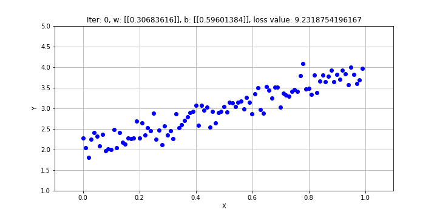

# Problem

Hôm nay, khi thực hiện code thử linear regression , lúc cần visualization lại cách mà gradient điều chỉnh rồi fit dần dần như thế nào, mình cần 1 cái ảnh gif để mình họa. Vấn đề là, `matpltlib`, công cụ visualization quen thuộc trong `python`, thì có 1 cách làm ảnh gif rất bất tiện.

```python
fig, ax = plt.subplots()

x = np.arange(0, 2*np.pi, 0.01)
line, = ax.plot(x, np.sin(x))

def animate(i):
    line.set_ydata(np.sin(x + i/10.0))  # update the data
    return line,

# Init only required for blitting to give a clean slate.
def init():
    line.set_ydata(np.ma.array(x, mask=True))
    return line,

ani = animation.FuncAnimation(fig, animate, np.arange(1, 200), init_func=init, interval=25, blit=True)
```

Vấn đề của hàm `FuncAnimation` là hàm `animate` có vẻ không phù hợp cho các ảnh gif có độ tùy chỉnh cao, và nói chung đọc qua thì mình cảm thấy nó hơi phức tạp quá mức cần thiết.

# Cách giải quyết

Để tạo ra ảnh gif, ta có thể lưu 1 list các ảnh, rồi kết nối các ảnh lại thành ảnh gif. Package sử dụng là imageio. Ta dùng hàm `mimsave` để tạo ra file gif từ 1 list các hình tĩnh.

```python
# some lines not related to visualization

def plot_for_offset(x, y, x_prime, w, b, i, loss_value):
    # Data for plotting
    fig, ax = plt.subplots(figsize=(10,5))
    ax.plot(x, y, 'bo', x_prime, x_prime * w[0,0] + b[0,0])
    ax.grid()
    ax.set(xlabel='X', ylabel='Y',
           title="Iter: {}, w: {}, b: {}, loss value: {}".format(i, w, b, loss_value))
    ax.set_xlim(-0.1, 1.1)
    ax.set_ylim(1, 5)

    # IMPORTANT ANIMATION CODE HERE
    fig.canvas.draw()       # draw the canvas, cache the renderer
    image = np.frombuffer(fig.canvas.tostring_rgb(), dtype='uint8')
    image  = image.reshape(fig.canvas.get_width_height()[::-1] + (3,))

    return image

image_list = []
iter_list = [0, 1, 2, 3, 4, 6, 9, 14]
epsilon = 5e-3

with tf.Session() as sess:
    sess.run(init_op)
    loss_value = 1
    i = -1
    while loss_value > epsilon:
        i += 1
        _, loss_value = sess.run((train, loss))
        b = biases.eval()
        w = weights.eval()
        if i in iter_list or (i + 1) % 10 == 0:
            image_list.append(plot_for_offset(x, y, x_prime, w, b, i, loss_value))
        if i > 200:
            break

imageio.mimsave('./linear_regression_fitting.gif', image_list, fps=1.5)
```

Tada, và sản phẩm của chúng ta là: 

<p align="center">
  <br>
  <i>Sử dụng gradient để fit linear regression</i>
</p>

# Tham khảo

1. https://ndres.me/post/matplotlib-animated-gifs-easily/


