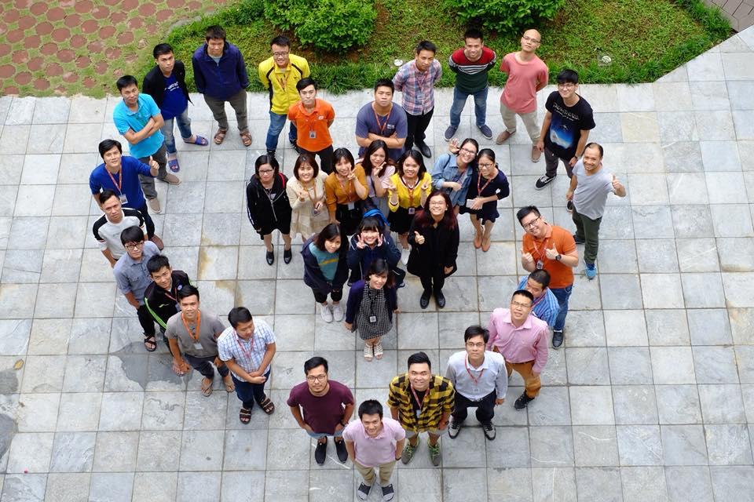

# Review 10 tháng đầu 2018

Mình có thói quen cứ tầm cuối tháng 11, mình sẽ review lại năm vừa qua và lên kế hoạch năm tới. Năm nay thì đã xóa personal blog cũ, cộng thêm muốn tách biệt hẳn mảng technical và personal, nên mình sẽ tổng kết ở đây.

Mình nghĩ tổng kết theo tháng là phù hợp, từ sau trở đi mình sẽ gắng tổng kết đều cuối mỗi tháng.

## Tổng quan chung

10 tháng rồi mình đã trải qua nhiều thứ, cụ thể là 4 công ty, với đủ các project và cung bậc cảm xúc.

Hiện tại mình vào FSS.CLI của Fsoft, và team ổn hơn mình kỳ vọng rất nhiều. Mình rất vui vì lựa chọn của mình có vẻ rất chính xác, và mình hy vọng sẽ có thể gắn bó lâu dài với mọi người.

   
  <i>Team mình nè, hãy đoán coi mình là aiiiii</i>

## Điều tích cực

Thay vì nói đã làm được, mình sẽ dùng từ điều tích cực. 

+ có định hướng rõ ràng, không còn mơ hồ nữa: làm sâu về CV, dùng DL. Tiếp tục tìm hướng để học RL.
+ tìm được 1 công ty tốt: Fsoft hóa ra rất ổn. Chính xác hơn, CLI Hà Nội rất ổn: mọi người kiến thức tốt, tinh thần cao, khả năng làm việc và quản lý dự án tốt, tinh thần trao đổi rất cao.
+ quen thêm một số người rất tích cực: họ giúp mình có thêm nhiều năng lượng, điển hình là anh Trung.
+ nghiêm túc phát triển bản thân: tập dùng code. Bắt đầu trở lại guồng làm việc và học tập.
+ tham gia dự án CV nghiêm túc, đào sâu vào thuật toán các thứ.

## Khó khăn

Việc thay đổi 3 công ty là 1 điều mình không muốn chút nào. Rất mất thời gian bản thân.

Ngoài ra, đáng tiếc là nỗ lực học RL lần 2 của mình (tháng 4) không thành công, cuốn RL an intro thực sự không hợp, giá mà effort mình đổ qua 1 MOOC khác thì có thể hoàn thành rồi. Điều đáng tiếc nữa là chưa kịp học xong quyển Intro to Algo.

Thêm nữa, mình chưa kịp học về hệ thống CSDL, chưa build được hệ thống thông tin chứng khoán cũng như thông tin cho LoL/bóng đá. Kế hoạch build chat bot tài chính cũng đổ bể. Quãng thwoif gian mùa hè không thực hiện được project nào ra hồn, khá đáng tiếc.

## Tổng kết lại

Nhìn chung, 10 tháng trôi qua mà bản thân mình chưa làm được gì đáng kể, đó là 1 điều đáng tiếc. Vì vậy, khi vào môi trường Fsoft, nhất là khi được ra HN thế này, hãy cố gắng để học thêm thật nhiều, bổ sung thật nhiều kiến thức, không chỉ về chuyên môn thuần túy àm còn về tạo lập, quản lý dự án các thứ nữa.

## Định hướng trong tháng tới (tháng 11)

- hoàn thành tốt project ở công ty (ưu tiên: rất cao)
- hiểu được YOLOv3, có thể custom được loss, tạo zone cho nó (ưu tiên: rất cao)
- biết qua về GCP, chạy được train trên GCP (ưu tiên: rất cao)

- hoàn thành khóa DLc4, Dlc3, DLc2 (ưu tiên: cao)
- học hết 12 lessons đầu của CS294, update đầy đủ trên github (ưu tiên: cao)
- theo lớp RL của phòng, tổ chức Piazza cho nhóm (ưu tiên: cao)

- tiếp tục quản lý code với git (ưu tiên: cao)