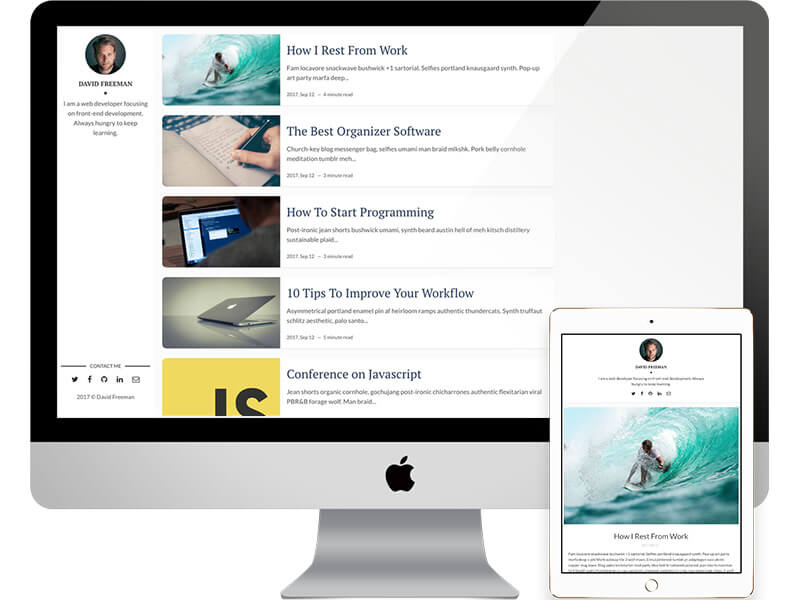
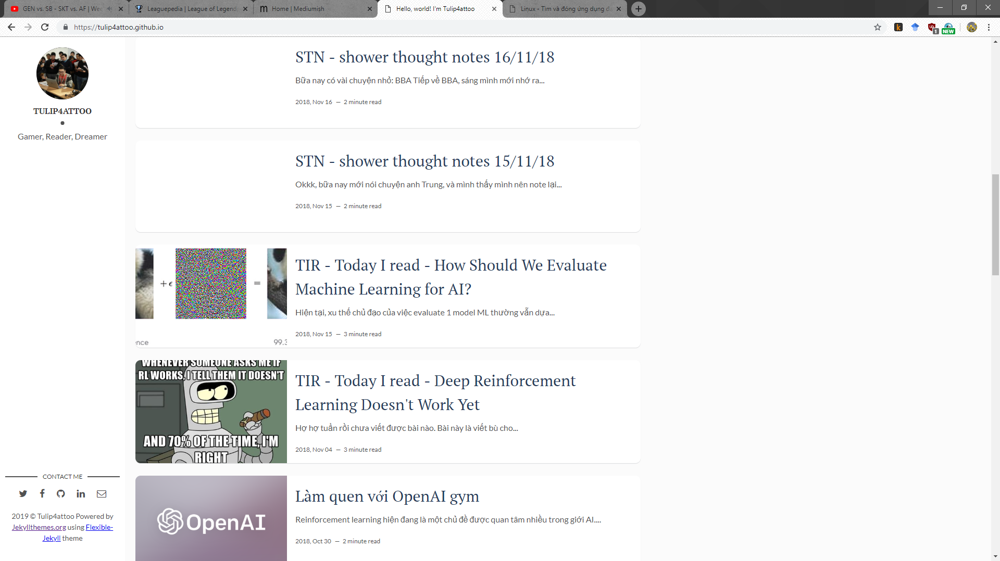
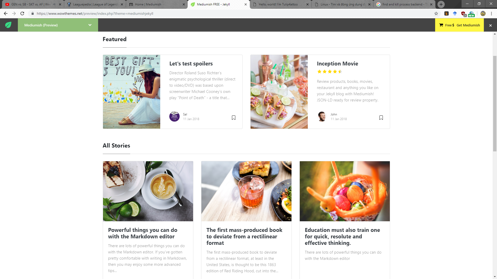
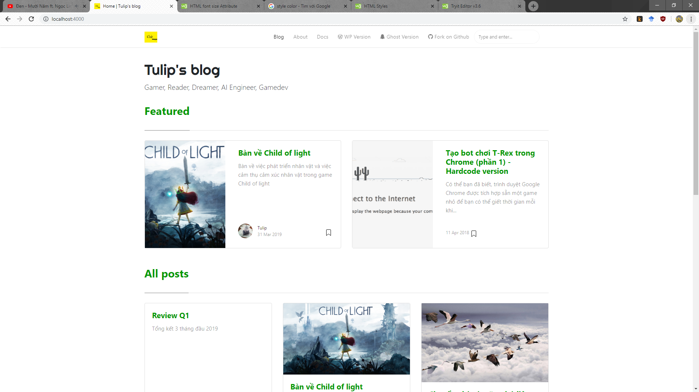

Sau 1 thời gian dùng theme Flexible-Jekyll và không ưng ý cho lắm, mình quyết định sẽ đổi sang 1 theme khác đẹp hơn. Việc chuyển theme mấy lần trước thì đơn giản, nhưng lần này cũng hơi phức tạp hơn, nên cũng muốn ghi ra đây.

# Lý do chuyển theme

Trước hết nói về lý do chuyển theme. Ban đầu thì mình nhìn theme cũng khá ổn, nhưng tới khi dùng thì không được như tưởng tượng lắm, âu cũng là vấn đề mua hàng trên mạng hmmm. Trông cũng chấp nhận được, nhưng chấp nhận được thì chưa bao giờ là hay cả.

<div align="center">
  <br>
  <i>Đây là hình ảnh được giới thiệu</i>
</div>

<div align="center">
  <br>
  <i>Đây là hình ảnh thực tế -_-!</i>
</div>

Có vài vấn đề mà trước khi xài theme này mình chưa tính tới:

+ theme này không hoạt động tốt trên màn hình rộng. Ngày mình làm theme này thì mình làm trên lap 15 inch, nó trông vẫn ổn. Tuy nhiên, mình mới chuyển qua máy mới, dàn PC của mình có 1 màn hình 27 inch, và trông nó khá là tệ như bên.
+ khi ảnh minh họa không nhiều màu sắc lắm thì trang trông hơi đơn điệu và nhạt nhòa.

Vì 2 lý do này, nên mình quyết định tìm một tấm áo đẹp hơn cho blog của mình. Dẫu sao thì thi thoảng thay đổi trông cũng vui mà.

# Chuyện tìm theme

Mình mấy hôm nay đang tập tọe học HTML và CSS 1 chút để làm mấy dự án ở công ty. Hiện tuy mình là 1 AI Engineer nhưng đôi lúc mình sẽ làm đủ các việc khác, và hiện mình đang làm UI cho 1 số project nữa. Thì khi làm cho sản phẩm của mình, đương nhiên mình cũng muốn làm cho mình 1 cái cho ra hồn.

Ban đầu mình tính sử dụng [theme này](https://www.w3schools.com/w3css/tryw3css_templates_blog.htm), khá chim ưng của W3School. Theme trông thanh thoát và dễ chịu, ngoài ra thích hợp với blog nữa.

<div align="center">
  <br>
  <i>Theme định dùng</i>
</div>

Tuy nhiên có làm mới thấy nhiêu khê. Nhìn source code mình thấy khối lượng công việc để chuyển từ đống HTML này qua cũng nhiều, nên mình quyết định tìm một theme Jekyll thuần hơn. Mình nghĩ mà chuyển từ đống này sang Jekyll, nhanh thì 3 ngày, không cũng phải 1 tuần mới xong. Kể ra thì cũng có hơi lười hehe. Vậy là lại lục lọi trên mạng và thấy 1 theme khác cũng ổn, dù mình không ưng quá do nó là phiên bản của medium thôi.

<div align="center">
  <br>
  <i>Theme mình chuyển sang dùng</i>
</div>

Tuy nhiên thực ra cũng chán khi mà dùng cái gì quá nhiều người dùng. Mình sẽ tự build theme Jekyll như trên nếu sắp xếp được thời gian (nghỉ việc chuẩn bị next job chẳng hạn).

# Những vấn đề khi migrate theme

Mấy lần trước chuyển theme thì mình chuyển cũng nhanh, phần vì có ít bài viết, phần vì các theme khá là đơn giản (thực ra mình cũng mất kha khá thời gian triển khai mathjax và disqus). Lần này làm hết 1 lúc nên thấy mất thời gian hơn, vì vậy nên mình viết ra đây luôn.

## Chuyện hiển thị offline để check theme.

Có 1 vấn đề mà mình gặp phải là mình toàn push bài lên github rồi mới xem bài có vấn đề gì không rồi sửa lại. Cách này ... rất ngu, do đó lần này mình tìm hgieeur cách để view offline blog mình để chỉ push code khi đã ok. Hóa ra cách làm rất đơn giản như ở [link này (chính chủ github luôn :)))](https://help.github.com/en/articles/setting-up-your-github-pages-site-locally-with-jekyll).

Tóm tắt:

+ cài Ruby, cài Jekyll sử dụng Bundler
+ tạo Gemfile 
+ run site của bạn ở local:

```
bundle exec jekyll serve
```

## Điều chỉnh để theme sống động hơn

Nếu nhìn kỹ, theme này chủ yếu vẫn là màu đen + trắng, nếu không cẩn thận rất có thể nó sẽ bị nhạt nhòa như theme trước. Mình chỉnh sửa đơn giản bằng việc thay 1 số text sang màu xanh. Thì cũng sửa dòng này ở file `index.html` thôi.

```html
<h2><span>Featured</span></h2>
```
thành
```html
<h2><span><p style="color:#009900; font-size:30px">Featured</p></span></h2>
```

Ngoài ra thì sửa đoạn code này trong file `featuredbox.html` và `postbox.html`
```html
<a class="text-dark" href="{{ post.url | absolute_url }}">{{ post.title }}</a>
```
thành
```html
<a class="text-dark" href="{{ post.url | absolute_url }}" style="color:#009900;">{{ post.title }}</a>
```

<div align="center">
  <br>
  <i>Và đây là thành quả</i>
</div>

## Disqus

Dù mình lập blog khoảng 4 năm và chưa 1 ai comment nhưng thôi, cứ làm cho zuiiii. Blog cũ thì có mục disqus mà blog mới thì nó bị hỏng. Vốn theme cũng có sẵn disqus nhưng không hiểu sao khi mình xài thì nó không chạy -_-~. Say 1 hồi loay hoay thì mình cũng tìm ra cách làm khá đơn giản, đó là chèn đoạn này vào `post.html`, bạn nhớ đổi `https://yoursitename.disqus.com/embed.js` thành site name của bạn (lấy ở disqus)

```html
<div id="disqus_thread"></div>
<script>
    /**
      *  RECOMMENDED CONFIGURATION VARIABLES: EDIT AND UNCOMMENT THE SECTION BELOW TO INSERT DYNAMIC VALUES FROM YOUR PLATFORM OR CMS.
      *  LEARN WHY DEFINING THESE VARIABLES IS IMPORTANT: https://disqus.com/admin/universalcode/#configuration-variables
      */
    /*
    var disqus_config = function () {
        this.page.url = PAGE_URL;  // Replace PAGE_URL with your page's canonical URL variable
        this.page.identifier = PAGE_IDENTIFIER; // Replace PAGE_IDENTIFIER with your page's unique identifier variable
    };
    */
    (function() {  // DON'T EDIT BELOW THIS LINE
        var d = document, s = d.createElement('script');
        
        s.src = 'https://yoursitename.disqus.com/embed.js';
        
        s.setAttribute('data-timestamp', +new Date());
        (d.head || d.body).appendChild(s);
    })();
</script>
<noscript>Please enable JavaScript to view the <a href="https://disqus.com/?ref_noscript" rel="nofollow">comments powered by Disqus.</a></noscript>
```

## Gõ công thức toán

Theme này (và rất nhiều theme khác) không hỗ trợ gõ công thức toán. Để gõ công thức toán, bạn cần sử dụng mathjax. Cách làm thì chỉnh sửa những phần sau:

+ copy file `mathjax.html` và `mathjax_support` vào thư mục `_includes`
+ thêm đoạn này vào file `post.html`

```

```

# To do

Vậy là cũng tạm coi như hoàn chỉnh blog rồi. Tuy nhiên, vẫn còn 1 số thứ có thể làm để blog đẹp hơn (again, nếu có thời gian). Bao gồm:

+ Chỉnh khung code qua màu đen.
+ thay đổi 1 số ảnh cho hợp.
+ hiển thị feauture image ở phần next/previous posts.
+ thêm 1 cột ở bên phải trong các bài viết nữa. Để như hiện tại thấy trống trải quá.
+ chỉnh header của blog.
+ chỉnh about page qua 1 trang html ngon hơn.
+ dọn rác.
+ có thể mình sẽ thay cả giao diện luôn.

Tuy nhiên vậy cũng tạm đủ rồi. Happy blogging!!