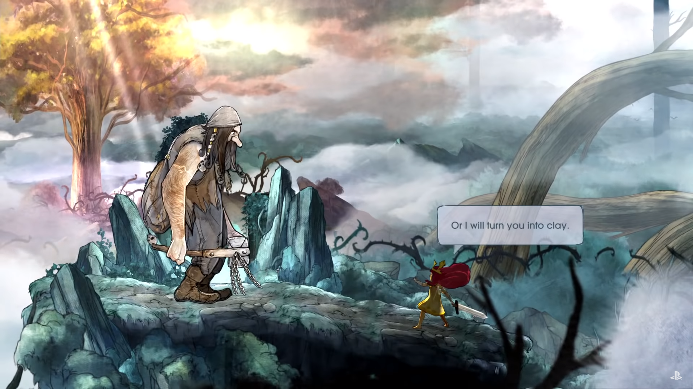
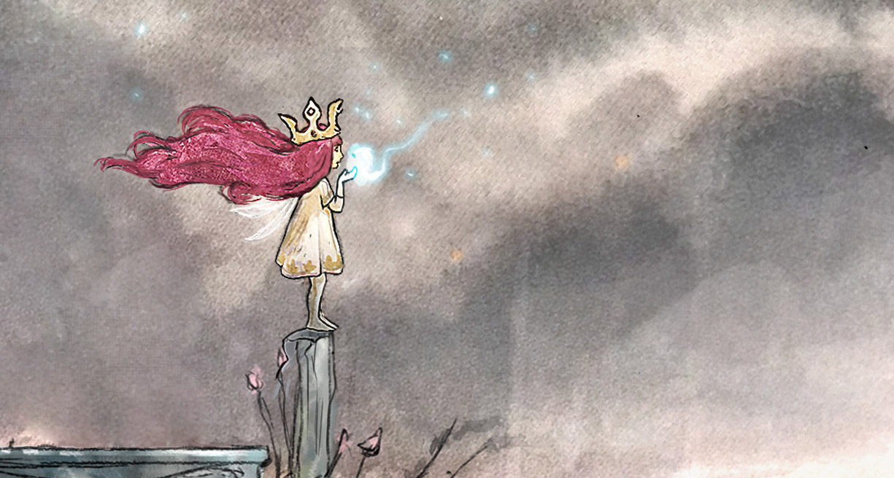

Biết tới Child of light đã rất lâu, thậm chí mình đã up bài wake up lên youtube cua rminhf từ tận mấy năm trước cũng như down về chơi thử rồi, nhưng mãi gần đây mình mới thật sự chơi game. Game cũng không quá dài, tầm 12h là có thể hoàn thành game khá trọn vẹn. Lúc chơi, có 1 giây phút mình cảm thấy thực sự nghẹn ngào, do đó mình quyết định viết bài viết này.

# Phát triển nhân vật

Một trong những điều tuyệt vời khác của game là quá trình phát triển nhân vật. Ban đầu, Aurora chỉ là một cô gái bé nhỏ. Em thức dậy ở một nơi trống trải và xa lạ, chân trần, chỉ có một bộ váy mỏng manh. Em sợ hãi, nhớ tới người cha vẫn luôn bảo vệ em. Lúc này, người chơi cũng cảm nhận được sự lo lắng ấy, bởi lẽ chúng ta mới vào game, và nhân vật chúng ta chơi còn quá nhỏ yếu, không vũ khí, không kỹ năng. Thậm chí, game cũng không có mini map hay chỉ dẫn, chúng ta thực sự cảm thấy rơi vào một thế giới xa lạ và nguy hiểm.



Nhưng dần dần, Aurora đi tiếp, kết bạn với nhiều người. Đầu tiên, Aurora gặp một chú đom đóm nhỏ tên là Igniculus. Cái lúc Aurora được The Lady of the Forest báo mộng, em rút ra thanh gươm trong đá và vui mừng vì mình đã có thứ để chiến đấu với những kẻ xấu trong giấc mơ. Nhạc nổi lên, chúng ta háo hức chờ đợi khoảng khắc chiến đấu đầu tiên.



Càng về sau, Aurora càng trở nên can đảm hơn, bản lĩnh hơn. Dưới vai trò người chơi, ta không ngại khi đối diện với những kẻ thù mới, dù chúng ta có thể thắng hay thua. Child of light đã thể hiện rất tốt bản lĩnh của em, đặc biệt khi em tiến tới dõng dạc nói chuyện với con nhện khổng lồ đang chiếm giữ trái tim của người khổng lồ đá. 

   
  <i>Aurora đối diện một gã khổng lồ</i>

Chúng ta đã cùng em đi một chẳng đường dài, từ một đứa trẻ nhút nhát cho tới khi em trở nên bản lĩnh hơn. Một số đoạn khác cũng được thể hiện tốt, ví như nỗi đau khi chia ly của em với các đồng bạn, sự gấp gáp của em khi không thể giúp anh bạn chiến binh to lớn giải cứu bộ lạc vì phải đi cứu cha.

# Giây phút chia ly

Cao trào của game ở đoạn Aurora trở về lâu đài và rời xa những người bạn của mình. Bạn biết có điều gì đó không ổn, hành trình chưa hẳn là dừng lại, nhưng khi Aurora trở về, thì những người bạn đồng hành sẽ không đi tiếp hành trình được nữa. Sự chia ly này, ngoài nỗi buồn chia ly đơn thuần, bạn còn mất đi những người để nương tựa vào khi gặp khó khăn. Nếu không có chú chuột Robert, chú hề Rubella thì làm sao bạn vượt qua được những thử thách phái trước. Sự buồn đau khi chia tay được khắc họa rất rõ.

   
  <i>Aurora, tình yêu là gì? 
  Là khi thật khó để nói lời chia ly</i>

Và sự mất mát lớn nhất là việc chia tay Igniculus. Có Igniculus, chúng ta sẵn sàng lao như bay vì biết rằng mỗi khi tổn thường sẽ có Igniculus trợ giúp, nhưng khi không còn Igniculus, chúng ta phải cẩn trọng trong từng bước đi. Cảnh Aurora trốn ra khỏi ngục, thận trọng đi từng bước và nhớ về Igniculus là giây phút đỉnh cao của mình với game này. Đây là điều đặc biệt của game, khi thay vì thấu cảm nhân vật để tới được những cung bậc cảm xúc, chúng ta trực tiếp là nhân vật và trực tiếp có những cảm xúc ấy, ở đây là nỗi buồn chia ly những người bạn của mình.

# Điểm trừ

Về trải nghiệm, Child of light vẫn có một số điểm trừ. Một số điểm trừ rõ rệt về mặt trải nghiệm mình thấy là:

+ game hơi dễ. Trừ 1 số cảnh khi gần trở về lâu đài (mà phải dùng tới bình hồi máu), thì gần như mình chơi mà chẳng cảm thấy chút áp lực nào cả. Đây cũng là vấn đề của game nói chung, làm sao để chọn được 1 độ khó thích hợp với mỗi người chơi để sự trải nghiệm ở mức độ cá nhân được đẩy lên cao nhất. Giá mà lúc Aurora vừa rời xa đồng đội, quái vật trở nên mạnh mẽ hơn để thấy sự yếu đuối khi cô đơn thì game sẽ còn tạo được nhiều cảm xúc cho người chơi hơn.

+ hệ thống combat chưa thực sự sâu, nhưng với mình thế cũng ok rồi. Tuy nhiên, nhưng ai khó tính chút sẽ thấy hơi đơn điệu. Thực sự, một phần do game cũng dễ, những combat gần cuối mình rất chán, chỉ muốn chơi qua cho mau. Việc này khiến người chơi mất đi cảm giác hứng thú khám phá tiếp những phần tiếp theo của game.

# Tổng kết

Mục đích cuối cùng của game, hay các loại hình nghệ thuật, với mình vẫn là truyển tải các cung bậc cảm xúc tới người chơi. Việc tạo được một môi trường để người chơi trải nghiệm là một lợi thế và đặc trưng của video game, khi người chơi trở thành nhân vật chính. Child of light đã làm tốt được chuyện này.

Hôm nọ, Child of light giảm giá trên Steam cùng 1 loạt game khác của Ubisoft, tầm 60k là cái giá quá hời cho một tựa game như thế này. Game cũng khiến mình thay đổi cái nhìn về game theo lượt (mình vốn cực kỳ không thích game theo lượt). Đáng mua, đáng chơi và đáng cảm nhận.

Bài viết được inspired từ [video này](https://www.youtube.com/watch?v=CNifodTs2GQ). Đây là 1 video cực kỳ đáng xem để hiểu thêm về nét đẹp của game.